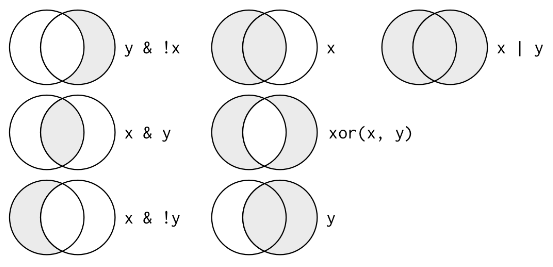

```{r}
library(tidyverse)
library(nycflights13)

?flights
```

The flights dataset from the nycflights13 is a tibble rather than a dataframe. Tibbles are essentially dataframes, reformated to work better with the tidyverse. 

Variable types abbreviations: int=integer, dbl=double, chr=character, dttm=date and time, lgl=logical, fctr=factor, date=date

**Select all flights on January 1st:**
```{r}
filter(flights, month == 1, day == 1) # prints
jan1 <- filter(flights, month ==1, day == 1) # saves to variable
(jan1 <- filter(flights, month ==1, day == 1)) # wrapping in parantheses both saves to variable and prints
```

**Boolean Operators:**



**Can Filter using Multiple Conditions with Boolean statements or the `%in%` operator:**
```{r}
(nov_dec <- filter(flights, month == 11 | month == 12)) 

(nov_dec <- filter(flights, month %in% c(11, 12)))
```

### NAs /  Missing Values

Missing values are represented in R with "NA." Any operation involving an NA will result in an NA. To check if a value is missing, use `is.na()`. Filter excluded NA values by default, but they can be included by asking for them to be included using `is.na`.

```{r}
df <- tibble(x = c(1, 2, 3, NA, 5, 6, NA, 8))
filter(df, is.na(x) | x < 5)
```


### Exercises:

Find flights that:

1. Had an arrival delay of two or more hours
1. Flew to Houston (IAH or HOU)
1. Were operated by United, American, or Delta
1. Departed in summer (July, August, and September)
1. Arrived more than two hours late, but didn’t leave late
1. Were delayed by at least an hour, but made up over 30 minutes in flight
1. Departed between midnight and 6am (inclusive)

```{r}
filter(flights, arr_delay >= 120)
filter(flights, dest %in% c('IAH', 'HOU'))
filter(flights, carrier %in% c('UA', 'AA', 'DL'))
filter(flights, month %in% c(7, 8, 9))
filter(flights, arr_delay > 120 & dep_delay == 0)
filter(flights, dep_delay > 120 & arr_delay < dep_delay - 30)
filter(flights, dep_time %in% c(2400:2459, 000:600))
```

```{r}
filter(flights, between(dep_time, 000, 600))
```


Check how many dep_times are missing:
```{r}
flights[is.na(flights$dep_time) == TRUE,] # with base R

filter(flights, is.na(dep_time)) # with tidyverse
```

*** `arrange`***

```{r}
arrange(flights, desc(arr_delay)) # flights arranged in order of longest to shortest arrival delay; default is assending order
```

```{r}
arrange(flights, desc(arr_delay))
```


### `select`

Can combine these additional functions with select to make the process easier!

* `starts_with`
* `ends_with`
* `contains`
* `matches`
* `num_range`

```{r}
select(flights, -(year:day)) # remove columns year through day
select(flights, c(contains("arr"), flight, carrier, year:day))
```


***`mutate` and related functions***

```{r}

```


